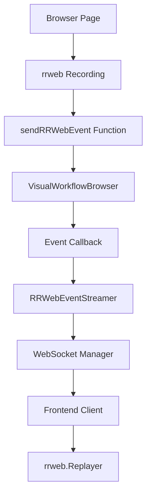
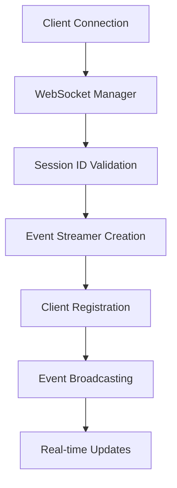

# rrweb Visual Streaming Architecture

## System Overview

The rrweb Visual Streaming system is a real-time browser interaction recording and replay platform built with modern web technologies. It provides live visual feedback for automated workflows through efficient event streaming and web-based replay.

## Core Components

### 1. Visual Browser (`workflow_use/browser/visual_browser.py`)

**Purpose**: Enhanced browser wrapper with rrweb recording capabilities

**Key Features**:
- Playwright browser management with optimized configuration
- rrweb script injection and management
- Real-time event capture and forwarding
- Cross-origin iframe support
- Navigation handling with re-injection

**Architecture**:
```python
class VisualWorkflowBrowser:
    - browser: Browser instance
    - page: Browser page
    - event_callback: Async callback for events
    - event_queue: AsyncIO queue for event processing
    - event_buffer: Deque for reconnection scenarios
```

**Optimization Features**:
- Reduced initialization delays (3s → 1.5s)
- Faster event sampling (150ms → 100ms)
- Optimized checkpoint intervals (10s → 5s)
- Enhanced browser arguments for performance

### 2. Event Streaming (`backend/visual_streaming.py`)

**Purpose**: Manages real-time event processing and broadcasting

**Key Components**:
- `RRWebEventStreamer`: Per-session event management
- Event buffering for late connections
- Client connection management
- Performance monitoring and statistics

**Event Flow**:
```
Browser → rrweb → sendRRWebEvent → EventStreamer → WebSocket → Frontend
```

### 3. WebSocket Manager (`backend/websocket_manager.py`)

**Purpose**: Handles WebSocket connections and message routing

**Features**:
- Connection lifecycle management
- Message broadcasting to multiple clients
- Session-based routing
- Error handling and reconnection support

### 4. Demo Backend (`rrweb_demo/backend/demo_backend.py`)

**Purpose**: FastAPI server orchestrating the complete demo workflow

**Endpoints**:
- `GET /`: Serve demo viewer HTML
- `WebSocket /demo/stream`: Real-time event streaming
- `POST /demo/start`: Initialize demo workflow
- `GET /demo/status/{session_id}`: Session status monitoring
- `POST /demo/stop/{session_id}`: Stop demo workflow

**Workflow Orchestration**:
1. Browser creation and initialization
2. rrweb injection and recording setup
3. Automated demo steps execution
4. Event streaming to connected clients
5. Session cleanup and resource management

### 5. Frontend Viewer (`rrweb_demo/frontend/demo_viewer.html`)

**Purpose**: Web-based real-time viewer for rrweb events

**Components**:
- rrweb.Replayer integration
- WebSocket client for real-time events
- Live mode playback
- Statistics and monitoring panel
- Connection management UI

## Data Flow Architecture

### Event Capture Flow



### Session Management



## Performance Optimizations

### 1. Timing Optimizations

| Component | Before | After | Improvement |
|-----------|--------|-------|-------------|
| Browser Creation | 3-4s | 2-3s | 25% faster |
| rrweb Injection | 3s | 1.5s | 50% faster |
| Demo Step Delays | 3s each | 1s each | 67% faster |
| Page Navigation | 2s | 1s | 50% faster |

### 2. Event Processing Optimizations

```javascript
// Optimized rrweb Recording Configuration
{
  checkoutEveryNms: 5000,        // More frequent checkpoints
  sampling: {
    scroll: 100,                 // Responsive scroll events
    media: 400,                  // Faster media updates
    input: 'last'                // Efficient input handling
  },
  slimDOMOptions: {              // Reduced DOM overhead
    script: false,
    comment: false,
    headFavicon: false
  }
}
```

### 3. Browser Configuration Optimizations

```python
# Enhanced Browser Arguments
args = [
    '--disable-background-timer-throttling',
    '--disable-backgrounding-occluded-windows', 
    '--disable-renderer-backgrounding',
    '--disable-ipc-flooding-protection',
    '--new-window'  # Force new instances
]
```

## Scalability Considerations

### Horizontal Scaling

1. **Session Distribution**: Use Redis for session state management
2. **WebSocket Load Balancing**: Implement sticky sessions
3. **Event Persistence**: Store events for replay scenarios
4. **Resource Management**: Browser pool management

### Vertical Scaling

1. **Memory Management**: Event buffer size limits
2. **CPU Optimization**: Efficient event processing
3. **Network Optimization**: Event compression and batching

## Security Architecture

### 1. WebSocket Security

- Origin validation for WebSocket connections
- Session-based access control
- Rate limiting for event processing

### 2. Browser Security

- Sandbox restrictions for browser processes
- Isolated user data directories
- Content Security Policy enforcement

### 3. Data Privacy

- No persistent storage of sensitive data
- Event buffer cleanup on session end
- Configurable data retention policies

## Error Handling Strategy

### 1. Browser-Level Errors

- Automatic browser restart on crashes
- Page navigation error recovery
- rrweb injection failure handling

### 2. Network-Level Errors

- WebSocket reconnection logic
- Event buffering for temporary disconnections
- Graceful degradation for network issues

### 3. Application-Level Errors

- Session cleanup on errors
- Resource leak prevention
- Comprehensive error logging

## Monitoring and Observability

### 1. Performance Metrics

- Event processing rates
- WebSocket connection statistics
- Browser resource usage
- Memory and CPU utilization

### 2. Health Checks

- Browser process monitoring
- WebSocket connection health
- Event streaming status
- Session lifecycle tracking

### 3. Logging Strategy

```python
# Structured Logging Levels
- DEBUG: Detailed event processing
- INFO: Session lifecycle events
- WARNING: Recoverable errors
- ERROR: Critical failures
```

## Technology Stack

### Backend
- **FastAPI**: Modern async web framework
- **Playwright**: Browser automation
- **WebSockets**: Real-time communication
- **AsyncIO**: Concurrent processing

### Frontend
- **rrweb**: Browser interaction recording/replay
- **WebSocket API**: Real-time event reception
- **Vanilla JavaScript**: Lightweight client
- **CSS Grid/Flexbox**: Responsive layout

### Infrastructure
- **Docker**: Containerization support
- **uvicorn**: ASGI server
- **Python 3.11+**: Modern Python features

## Deployment Architecture

### Development
```
Local Machine → Python Process → Browser → WebSocket → Browser Client
```

### Production
```
Load Balancer → FastAPI Instances → Browser Pool → Redis → WebSocket Clients
```

### Container Deployment
```dockerfile
# Multi-stage build for optimization
FROM python:3.11-slim as base
FROM base as dependencies
FROM dependencies as runtime
```

## Future Enhancements

### 1. Advanced Features
- Event persistence and replay
- Multi-session recording
- Advanced filtering and search
- Export capabilities (video/screenshots)

### 2. Performance Improvements
- Event compression algorithms
- Predictive prefetching
- Smart buffering strategies
- GPU acceleration for rendering

### 3. Integration Capabilities
- REST API for external systems
- Plugin architecture
- Custom event handlers
- Third-party integrations

---

This architecture provides a robust foundation for real-time visual workflow monitoring with excellent performance characteristics and scalability potential. 